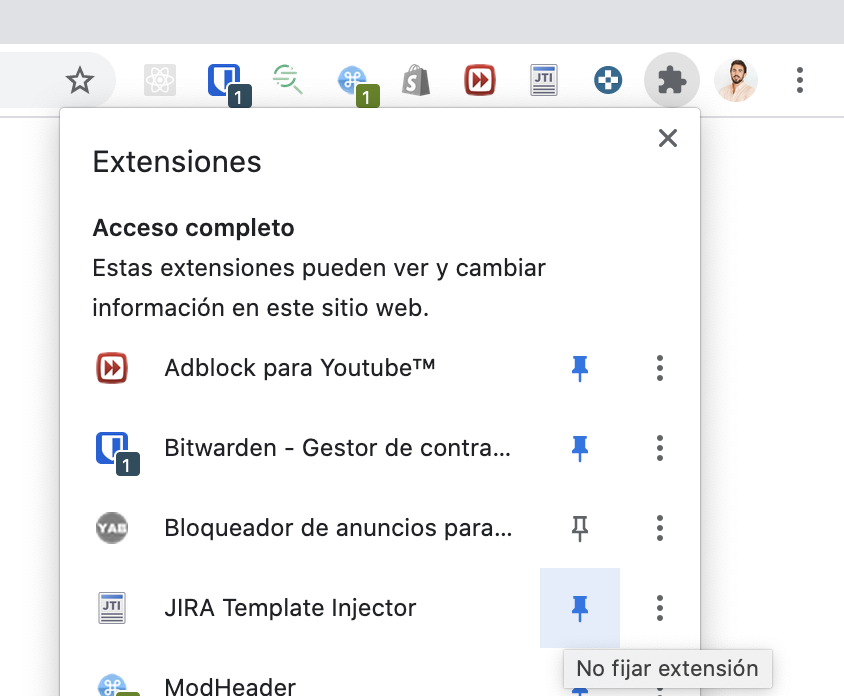
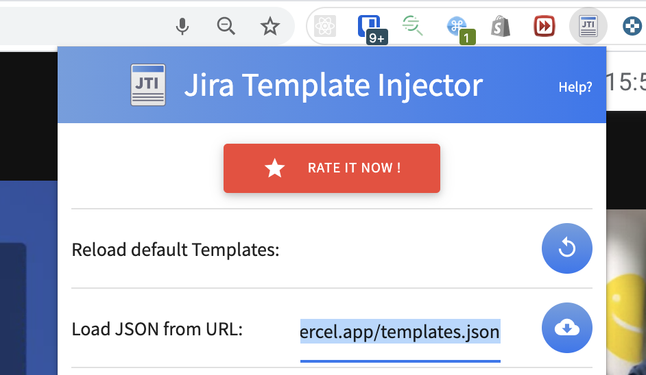
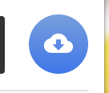
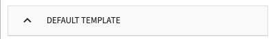
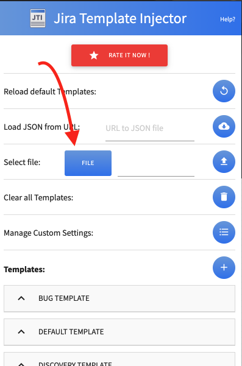
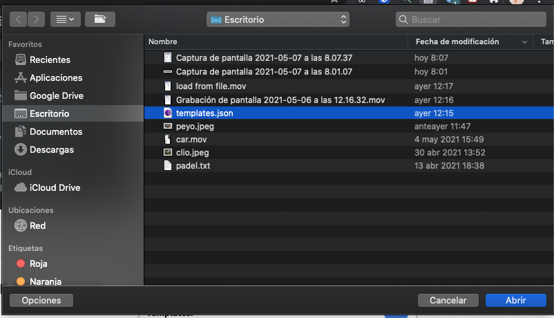

# JIRA template

1. Install the JIRA Template Injector: https://chrome.google.com/webstore/detail/jira-template-injector/hmhpegjieopgbdmpocdmfkafjgcdmhha

2. If you don't see the JIRA Extension you will need to pin it:

3. Open the extension and Add the URL: https://breakingads.vercel.app/templates.json into 'Load JSON from URL' input in the extension.

4. Click the upload icon

5. Click on one template, for example the Default Template and Click on the Save button

   

6. You are ready now. But if you want to customize your own template.

- You can start downloading the file: https://breakingads.vercel.app/templates.json and saving it in your Desktop in your PC.
- Then, you can modify it in your laptop.
- And, finally you can upload it again in the extension, but this time instead of loading the template 'from URL' you will load it from your local file.
- Maybe you will need to repeat step 5.
